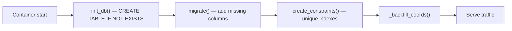

# Deployment Guide

> Reflects the **current implemented backend** ✅. Base deploy notes:
> `../../DEPLOY.md`. Architecture: [SYSTEM_ARCHITECTURE](SYSTEM_ARCHITECTURE.md).

## 1. Runtime shape

- One **FastAPI** container serves the REST API, the built React panel (`/panel`),
  and the webviews (`/web/*`). Built by the repo `Dockerfile`.
- **No background workers, cron, or queues.** Schema is created/migrated
  **synchronously on boot** (`init_db()` + `migrate()` + `create_constraints()`),
  then the app serves traffic.
- **HTTPS is required** (phone camera + geolocation on the scan flow; bearer
  tokens in transit).
- **Stateless app**; all state is in Postgres. Safe to run behind a load balancer
  (but see rate-limit storage in §3).

## 2. Required environment variables

| Var | Required | Default | Purpose |
|---|---|---|---|
| `DATABASE_URL` | Prod: **yes** | — (SQLite `qr_api.db`) | Postgres/Neon **pooled** connection string. Unset → local SQLite (dev only). |
| `QR_BASE_URL` | **Yes for prod** | `http://127.0.0.1:8000/web/scan` | Origin baked into every QR payload. **Must be the deployed HTTPS origin + `/web/scan` before any production print run**, or printed codes point at the wrong host. |
| `SSO_SECRET` | **Yes (to enable SSO)** | — | Shared HMAC secret for assertion verification. Unset → `/auth/sso/*` return `503`. |
| `SSO_ISSUERS` | No | `vastra,yourapp` | Allowed JWT `iss` values (comma-separated). |
| `SSO_AUDIENCE` | No | `loyalty` | Required JWT `aud`. |
| `SSO_MAX_AGE` | No | `120` | Max assertion age (seconds); bounds replay. |
| `VASTRA_API_BASE_URL` | **Yes (to power the panel's Vastra OTP login + product picker)** | — | Vastra's API origin, called server-side only (`app/vastra_client.py`). Unset → OTP login and `GET /vastra/products` fail closed with `502`. Companions: `VASTRA_API_KEY` (`api-key` header), `VASTRA_UDID`/`VASTRA_DEVICE_TYPE` (device headers, fixed defaults ok), `VASTRA_API_TIMEOUT` (default 10s). |
| `VASTRA_API_KEY` | Depends on Vastra's contract | — | Credential for the Vastra product-list API; never sent to the browser. |
| `VASTRA_API_TIMEOUT` | No | `10` | Timeout (seconds) for the outbound call to Vastra. |
| `YOURAPP_API_KEY` | **Yes (to enable YourApp server-to-server scan)** | — | Shared secret YourApp's backend sends as `X-API-Key` to `POST /yourapp/qr/lookup` / `POST /yourapp/scan` (phone-verified scanning). Unset → those endpoints return `503`. Server-side only — never in a mobile build. |
| `RL_ENABLED` | No | `1` | Master switch for rate limiting (`0` disables). |
| `RL_LOGIN` | No | `10/minute` | Limit for login + SSO endpoints. |
| `RL_SCAN` | No | `60/minute` | Limit for `/scan`. |
| `RL_CLAIM` | No | `20/minute` | Limit for `/retailer/claim`. |
| `RL_QRGEN` | No | `30/minute` | Limit for `/qr/generate`. |
| `RL_IMPORT` | No | `10/hour` | Limit for CSV imports. |
| `RL_STORAGE_URI` | **If >1 process** | in-memory | Shared store (e.g. `redis://…`) so rate limits hold across replicas. |

> Dependency: `pyjwt` (in `requirements.txt`) is required for SSO.

## 3. Scaling note (important)

Rate limiting defaults to **in-memory** storage. If you run **more than one
process/replica**, set `RL_STORAGE_URI` to a shared backend (e.g. Redis) or each
replica enforces its own independent limits (effectively multiplying them).

## 4. Database & migrations

- **Dual backend:** Postgres when `DATABASE_URL` is set, SQLite otherwise.
- **Migrations are additive and idempotent**, applied automatically on every
  boot:
  - New tables via `CREATE TABLE IF NOT EXISTS`.
  - New columns via the `_MIGRATIONS` list (`ADD COLUMN IF NOT EXISTS` on PG;
    PRAGMA-checked on SQLite).
  - Constraints/indexes via `_CONSTRAINTS` (each isolated; a legacy-data conflict
    is non-fatal and logged-over).
- **SSO migration content already present:** `manufacturers.external_id`,
  `retailers.external_id`, and unique indexes `uq_manuf_external` (global) and
  `uq_retailer_external` on `(manufacturer_id, external_id)`.
- **Never reseed or drop the production (Neon) database.** The app **never seeds**
  on boot; `seed.py`/`reset_db()` are destructive and for local/initial use only.

## 5. SSO configuration

1. Generate a strong random `SSO_SECRET`; share it **only** with the Vastra and
   YourApp backends (never the mobile apps). Keep it out of source control.
2. Confirm `SSO_ISSUERS`/`SSO_AUDIENCE` match what the parent backends put in the
   JWT (`iss`/`aud`). Defaults: `vastra,yourapp` / `loyalty`.
3. Keep `SSO_MAX_AGE` small (default 120 s). Ensure server clocks are synced (NTP)
   so the `iat` freshness check doesn't reject valid assertions.
4. Verify: an unset `SSO_SECRET` makes `/auth/sso/*` return `503` — a quick way to
   confirm whether SSO is enabled in an environment.

## 6. Production deployment (Render + Neon, representative)

1. Provision Neon Postgres; copy the **pooled** connection string.
2. Create the Docker web service from the repo; region close to users (India).
3. Set env: `DATABASE_URL`, `QR_BASE_URL=https://<host>/web/scan`, `SSO_SECRET`,
   `VASTRA_API_BASE_URL` + `VASTRA_API_KEY` (needed for the panel's Products
   tab / QR generation to work — otherwise `GET /vastra/products` returns
   `502`) (+ optional `SSO_*`, `VASTRA_API_TIMEOUT`, `RL_*`, `RL_STORAGE_URI`
   if multi-replica).
4. Deploy. On boot the app creates/migrates tables (no seed) and starts serving.
5. Import production **manufacturers** (with `external_id`) and have each
   manufacturer provision **retailers** (with `external_id`). See
   [INTEGRATION_CHECKLIST](INTEGRATION_CHECKLIST.md).

## 7. Health checks

There is no dedicated `/health` endpoint. Recommended liveness/readiness probes:
- **Liveness:** `GET /openapi.json` (200 = app up).
- **Readiness (DB):** `GET /public/cities` (200 = app + a trivial path OK), or a
  lightweight authenticated `GET /auth/me` in a smoke test.
- **SSO enabled check:** `POST /auth/sso/manufacturer` with an empty/invalid body
  returns `503` if `SSO_SECRET` is unset, otherwise `401/422` — distinguishes
  "SSO off" from "SSO on".

> If you want a true `/health`, that's a small backend addition (not present
> today) — request it explicitly; do not assume it exists.

## 8. Verification checklist (post-deploy smoke)

- [ ] `GET /openapi.json` → 200.
- [ ] `GET /docs` renders.
- [ ] `POST /auth/sso/manufacturer` with a **valid** test assertion → 200 + token;
      token works on `GET /auth/me`.
- [ ] `POST /auth/sso/retailer` with a valid assertion → 200 + token; works on
      `GET /retailer/me`.
- [ ] Unknown `external_id` → 403 (and **no** row created).
- [ ] Tampered/expired assertion → 401.
- [ ] A scan of a generated code → 200 + correct points; re-scan → 409.
- [ ] `QR_BASE_URL` in a generated `payload` matches the deployed HTTPS origin.

## 9. Rollback strategy

- **App rollback:** redeploy the previous image. **Safe** — schema changes are
  additive (new nullable columns + partial indexes), so an older app version
  ignores the new columns and keeps working. No down-migration needed.
- **Do NOT drop columns/indexes to "roll back" schema** on Neon — additive
  artifacts are harmless to leave in place and dropping risks data/uptime.
- **Disable SSO quickly:** unset `SSO_SECRET` → `/auth/sso/*` return `503` while
  password logins keep working (web panel unaffected).
- **Disable rate limiting quickly:** `RL_ENABLED=0`.
- **Data:** Neon point-in-time restore is the backstop for accidental data
  mutations. Never use `seed.py`/`reset_db()` against production.

## 10. Production checklist

- [ ] `DATABASE_URL` = Neon **pooled** string.
- [ ] `QR_BASE_URL` = deployed HTTPS origin + `/web/scan` (set **before** any print run).
- [ ] `SSO_SECRET` set (strong, secret); `SSO_*` aligned with parent backends.
- [ ] `VASTRA_API_BASE_URL` + `VASTRA_API_KEY` pointed at Vastra's **production** API (contract implemented + verified against staging 2026-07-16; confirm the production origin/api-key with Vastra's team) — otherwise the panel's OTP login and Products tab / QR generation can't work.
- [ ] `YOURAPP_API_KEY` set (strong, secret) and shared only with YourApp's backend; every retailer imported with their YourApp phone number (phone identifies the retailer on `/yourapp/scan`).
- [ ] `RL_STORAGE_URI` set if running >1 replica.
- [ ] HTTPS enforced; CORS restricted to real app/panel origins.
- [ ] Manufacturers imported with `external_id`; retailers provisioned with `external_id`.
- [ ] Smoke checklist (§8) passes.
- [ ] Monitoring/logging in place (see [INTEGRATION_CHECKLIST](INTEGRATION_CHECKLIST.md) → DevOps).
- [ ] Seeded demo passwords rotated / demo data absent in prod.
