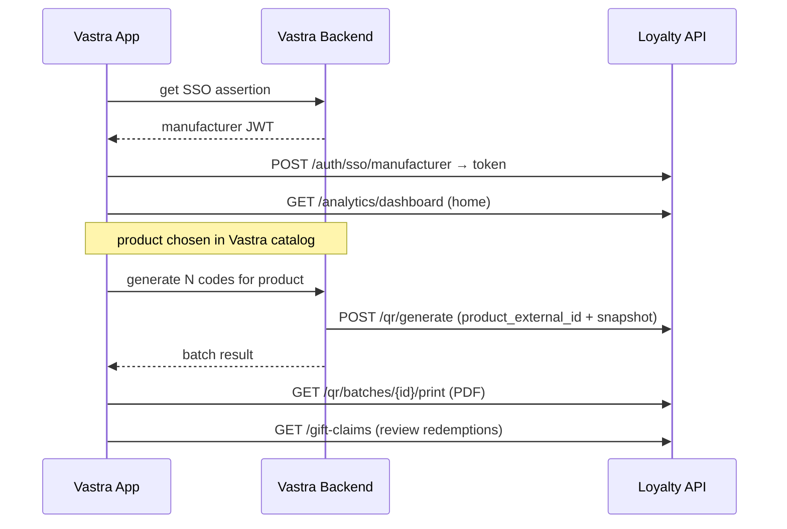
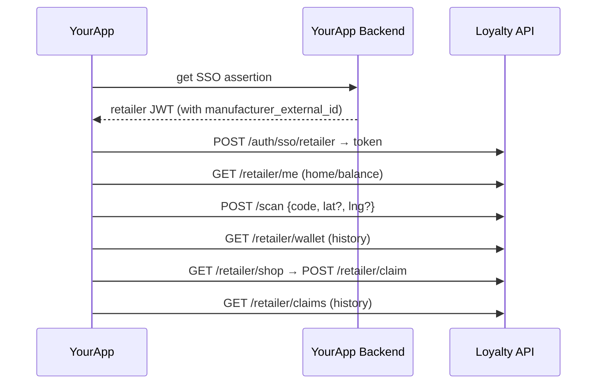

# Mobile Integration Guide (Android & iOS)

> Audience: the team building the native Vastra App (manufacturer) and YourApp
> (retailer). Pair this with [API_REFERENCE](API_REFERENCE.md),
> [SSO_INTEGRATION](SSO_INTEGRATION.md), and [ERROR_REFERENCE](ERROR_REFERENCE.md).

## 0. Ground rules

- **Auth:** get an SSO assertion from your own (parent) backend, exchange it for a
  loyalty token, send `Authorization: Bearer <token>` on every call. Never embed
  `SSO_SECRET` in the app.
- **Token storage:** OS secure store only — iOS Keychain, Android
  Keystore-backed `EncryptedSharedPreferences`. Never plain prefs/UserDefaults.
- **The loyalty token is opaque** — do not decode it. On `401`, re-exchange a
  fresh assertion (see SSO doc). There is no loyalty refresh token.
- **Products are selected in the Vastra catalog, not fetched from loyalty.** The
  mobile app never calls loyalty to list products. (See
  [PRODUCT_INTEGRATION](PRODUCT_INTEGRATION.md).)
- **Idempotency:** `/scan` and `/retailer/claim` are **not** safe to blind-retry
  on an ambiguous network failure (they change balances). See §Retry behavior.

---

# Manufacturer flow (Vastra App)

### Open Loyalty
- **API:** `POST /auth/sso/manufacturer` → store token. Then `GET /analytics/dashboard` for the landing screen.
- **UX:** show a spinner during exchange; cache the dashboard and refresh on pull-to-refresh.
- **Loading state:** skeleton cards for the stat rows.

### Generate QR
- **API (target):** the app asks the **Vastra backend** to generate; the Vastra
  backend calls `POST /qr/generate` with trusted product data and returns the
  result. The app does **not** call loyalty `/qr/generate` directly and does
  **not** send the points value. (Current backend still accepts `product_id`
  directly — see [PRODUCT_INTEGRATION](PRODUCT_INTEGRATION.md) for the migration.)
- **Inputs from the user:** product (already selected in the Vastra catalog),
  quantity, optional box size.
- **Response:** `batch_id`, per-code `token`/`manual_code`/`payload`, and
  `actions` (save/print/discard).
- **UX:** confirm quantity before generating (it's a real print run); show a
  success screen with the batch id and a "Print" CTA. Offer "Save batch".
- **Loading state:** disable the Generate button while in-flight; large
  quantities take longer (single synchronous call).

### Download / Print QR
- **API:** `GET /qr/batches/{id}/print` → `application/pdf` (binary). Single QR
  images via `GET /qr/codes/{token}/image` → PNG (no auth needed).
- **UX:** open the PDF in the OS share/print sheet. For an in-app preview, render
  PNGs from `payload`/`token`. There is **no ZIP** endpoint — if you need a
  bundle, render client-side or request a backend addition.
- **Loading state:** "Preparing PDF…"; the PDF can be large for big batches.

### Analytics
- **API:** `GET /analytics/dashboard` (everything in one call: totals,
  by_region/product/distributor, top_retailers, map_points, by_month).
- **UX:** two stat rows (funnel + redemption requests), region/distributor
  tables, a scan map, and month bar charts. All values are manufacturer-scoped.
- **Loading state:** skeletons; the payload is a single fetch.

### Claims (manufacturer side)
- **APIs:** `GET /gift-claims?status=pending` (inbox) · `POST /gift-claims/{id}/approve` · `POST /gift-claims/{id}/reject` (refunds points).
- **UX:** a pending list with approve/reject; **confirm before deciding** (it
  moves points). Show the proof `reference`, retailer, gift, points.
- **Errors:** `409 Claim already <status>` → refresh the list (someone else
  decided it). `404 Claim not found` → remove from list.

---

# Retailer flow (YourApp)

### Login
- **API:** `POST /auth/sso/retailer` → store token. (Production retailer access is
  SSO-only; password login exists only for dev/test.)
- **UX:** silent — the user is already logged into YourApp; do the exchange in the
  background and land on Home.
- **Errors:** `403 Retailer not provisioned` → "Your shop isn't set up for
  rewards yet — contact your manufacturer." Don't retry.

### Home
- **API:** `GET /retailer/me` → `balance`, `shop_name`, `region`, `manufacturer`,
  `must_change`.
- **UX:** show the points balance prominently + a primary "Scan" CTA.

### Scan QR
- **API:** `POST /scan { code, lat?, lng? }`. `code` = scanned token or typed
  6-char manual code (dashes/spaces tolerated).
- **UX:** camera scanner with a manual-code fallback field. Ask for location
  **up front** (high-accuracy GPS, secure context); if denied, scanning still
  works (falls back to the registered city). On success, show points earned
  (`points_awarded`, with base/bonus split and `scheme` name if present) and the
  new balance; a celebratory animation is appropriate. For a box, show
  `items_registered`.
- **Errors:** `404 Invalid code` → "This code isn't valid." `409 ... already
  redeemed` → "This code was already used." Both are normal, non-retryable UX
  states. `401` → re-exchange token and retry once.
- **Loading state:** disable the redeem button while in-flight; show a brief
  "Redeeming…".

### Wallet
- **API:** `GET /retailer/wallet` → `balance` + `history` (latest 100 ledger
  entries with type, points, product/scheme labels).
- **UX:** balance header + transaction list (earned/spent/refund/adjust/transfer).
  Note: history is capped at 100 (no pagination today).

### Rewards
- **APIs:** `GET /retailer/shop` (active gifts + `affordable` flag + balance) ·
  `POST /retailer/claim { gift_id }`.
- **UX:** gift grid with cost and an "affordable" indicator; **confirm before
  claiming** (points are debited immediately). Show the returned `reference` as
  proof and the new balance.
- **Errors:** `409 Not enough points` → keep the user on the gift, show balance.
  `404 Gift not available` / `403 Gift belongs to another manufacturer` → refresh
  the shop list.

### Claims (history)
- **API:** `GET /retailer/claims` → list of `{ reference, gift_name, image_url,
  points_spent, status (pending/approved/rejected), created_at, decided_at }`.
- **UX:** order-history style; show status chips and the proof reference.

---

## Error handling (cross-cutting)

| HTTP | Meaning | App behavior |
|---|---|---|
| `401` | token missing/invalid/expired | Re-exchange a fresh assertion → retry the call **once**. If still 401, send to login. |
| `403` | not provisioned / cross-tenant / wrong owner | Show a clear "not set up / not allowed" message. **Do not retry.** |
| `404` | invalid code / missing resource | Show a specific message; for `/scan` this is a normal UX state. |
| `409` | already redeemed / not enough points / already decided | Show the specific state; refresh the relevant view. **Do not auto-retry.** |
| `422` | validation error | Fix the input; surface field-level feedback. |
| `429` | rate limited | Back off (exponential) and retry; show a subtle "try again shortly". |
| `503` | SSO not configured | Server/config issue; show "service unavailable", alert DevOps. |
| `5xx` | server error | Retry idempotent GETs with backoff; for writes, see below. |

Full list: [ERROR_REFERENCE](ERROR_REFERENCE.md).

## Retry behavior

- **GETs** (dashboard, wallet, shop, claims, batches): safe to retry with
  exponential backoff + jitter on network/`5xx`/`429`.
- **`/scan` and `/retailer/claim`** change balances and are **not idempotent**.
  On an ambiguous failure (timeout, no response), **do not blindly resend** —
  instead re-fetch state (`GET /retailer/me` or `/retailer/wallet`) to see whether
  the action landed, then decide. A duplicate `/scan` of a code that *did* succeed
  returns `409` (safe), but a duplicate `/retailer/claim` could double-spend, so
  verify first.
- **Token refresh:** treat `401` as a one-shot re-exchange + single retry to avoid
  loops.

## Loading & empty states (recommendations)

- Use skeletons for dashboard/wallet/shop lists; spinners for single actions.
- Empty states: "No scans yet — scan your first sticker", "No rewards available",
  "No claims yet".
- Disable mutating buttons while their request is in flight to prevent
  accidental double submits.
