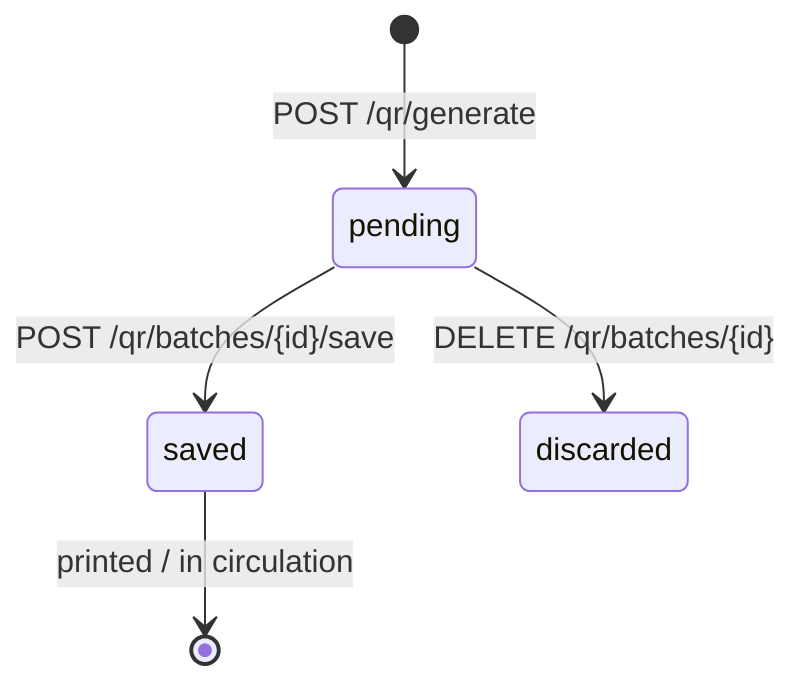
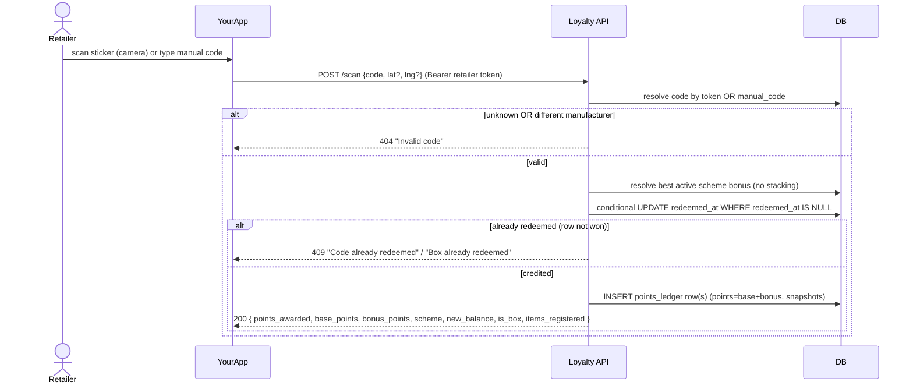
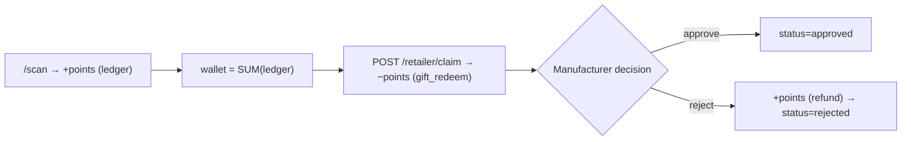

# QR Workflow

> Reflects the **current implemented backend** ✅. Endpoints: see
> [API_REFERENCE](API_REFERENCE.md). Product reference + snapshot model is
> implemented ✅ (dual-contract); see [PRODUCT_INTEGRATION](PRODUCT_INTEGRATION.md).

## 1. Concepts

| Term | Meaning |
|---|---|
| **Batch** | One generation run for a product: a quantity, a frozen `points_per_code`, and a `status` (`pending` → `saved`). |
| **Code** | A single QR. Has an opaque `token` (`uuid4().hex`), a 6-char `manual_code` fallback, and redemption state. |
| **Child / Parent (box)** | Children are individual item codes. If `items_per_box` is set, **parent** (box) codes are created; scanning a box redeems all its children at once. |
| **Payload** | What the QR encodes: `{QR_BASE_URL}/{token}` — a URL, not product data. |
| **Ledger row** | An append-only `points_ledger` entry; a scan writes one row **per child code**. |

**Points are frozen at generation.** `points_per_code` is captured on the batch,
so reprints / old stickers keep their promised value even if the product's points
later change. Schemes add a time-bound bonus *on top* at scan time.

## 2. QR generation lifecycle

```mermaid
sequenceDiagram
  participant C as Caller (Loyalty Admin Panel)
  participant L as Loyalty API
  participant DB as DB
  C->>L: POST /qr/generate {product, quantity, points_per_code?, items_per_box?}
  opt legacy product_id body only
    L->>DB: validate product belongs to manufacturer
  end
  L->>DB: INSERT qr_batches (status=pending, points_per_code frozen)
  L->>DB: INSERT N child qr_codes (unique token + manual_code)
  opt items_per_box set
    L->>DB: INSERT parent (box) codes; link children via parent_token
  end
  L-->>C: 201 { batch_id, codes[], boxes_codes[], actions }
  Note over C: A4 sticker sheet is rendered in the browser<br/>from the returned codes (payload + manual_code)
  C->>L: POST /qr/batches/{id}/save  (pending → saved)
```

The caller is now the **loyalty admin panel** (manufacturer logs in
directly) — see [PRODUCT_INTEGRATION](PRODUCT_INTEGRATION.md) for how the
panel sources the product list from the manufacturer's own CSV import
beforehand. With the primary
`product_external_id` contract, loyalty does **not** validate the product
against a local table (it has none); that validation only happens for the
legacy `product_id` body.

- `quantity`: 1–10,000 per call. `items_per_box`: 2–1,000.
- Manual codes use an unambiguous alphabet (no `0/O/1/I`).
- A batch left `pending` can be discarded with `DELETE /qr/batches/{id}`.

## 3. QR batch lifecycle



`saved` batches can be printed any time: the panel re-fetches
`GET /qr/batches/{id}` (which returns each code's `payload`, `manual_code`,
`is_parent` and `items`) and lays the sheet out in the browser
(`panel/src/utils/stickerPdf.js`, a port of the server layout — same A4 grid,
same fonts, same output). The server-rendered
`GET /qr/batches/{id}/print` still exists for direct API callers, but the panel
no longer uses it: the PDF grows ~5.2 KB per code, so a 2,000-sticker batch is
10.3 MB — past Lambda's 6 MB buffered response cap — while the same batch as
JSON is ~180 KB and costs the server no PNG rendering.

The QR payload string is always taken from the API response verbatim and never
rebuilt client-side: `QR_BASE_URL` is server-side config, and a frontend copy
that drifted would send every printed sticker to a dead host.

Discarding deletes the batch and its codes (only sensible while pending).

## 4. QR scan lifecycle & redemption



**Box scan:** a parent redeems every still-unredeemed child; one ledger row is
written **per child**, and the response sums them (`items_registered`,
`points_awarded`). Already-fully-redeemed box → `409`.

**Server-to-server variant:** YourApp's backend can run the same redemption
without a retailer session via `POST /yourapp/scan {phone, code, lat?, lng?}`
(auth `X-API-Key` = `YOURAPP_API_KEY`; the retailer is matched by registered
phone, last 10 digits, within the scanned code's manufacturer), and preview a
code first with the read-only `POST /yourapp/qr/lookup {code}` (product,
points, `qrStatus: available|redeemed` — never redeems). Both share this exact
redemption core, so all the states above are identical. Both also carry the
boolean `status` (did the call work) that every `/yourapp/*` response does. See
[API_REFERENCE](API_REFERENCE.md) and
[YOURAPP_SCAN_API](YOURAPP_SCAN_API.md).

## 5. Duplicate prevention (double-spend safety)

Redemption is race-safe by design — **not** a read-then-write check:
1. The redeem is a **conditional UPDATE**: `SET redeemed_at=now WHERE token=? AND redeemed_at IS NULL`. Only the transaction that flips the row from NULL "wins"; concurrent scans see `rowcount = 0` and credit nothing.
2. A **partial UNIQUE index** on `points_ledger(token)` is the belt-and-suspenders backstop against a second ledger row for the same code.

Net effect: a code is credited **at most once**, even under concurrent scans.
Re-scanning a redeemed code returns `409` (a distinct, expected signal the UI
should handle gracefully). There is **no "expired code" state** — codes do not
expire; only the scheme *bonus* is time-bounded.

## 6. Points allocation

```
points_awarded (per child) = base_points + bonus_points
  base_points  = batch.points_per_code            (frozen at generation)
  bonus_points = best active scheme's bonus_points (0 if none)
```
Scheme selection at scan time: among the manufacturer's schemes whose date window
covers "today" and whose scope includes the product (or which cover all
products), the **single most generous** bonus applies — **no stacking**. The
chosen scheme id and the base/bonus split are recorded on each ledger row.

## 7. Ledger updates

Every scan writes one `points_ledger` row per credited code with:
`entry_type='scan'`, `points` (= base+bonus), `base_points`, `bonus_points`,
`scheme_id`, `token`, `product_id`, and **point-in-time snapshots** `region`,
`distributor_id`, `lat/lng`. The wallet balance is always
`SUM(points_ledger.points)` for the retailer — never a stored field.

Ledger entry types: `scan` (+), `gift_redeem` (−), `refund` (+), `adjustment`
(±), `transfer` (±), `scan_reversed` (+, a scan undone by the manufacturer,
excluded from scan analytics), `reversal` (−, the offsetting deduction written
when a scan is reversed). See [SYSTEM_ARCHITECTURE §8](SYSTEM_ARCHITECTURE.md#8-data-ownership-principles).

**Scan reversal.** If the wrong retailer scans a code (e.g. the buyer's shipment
was scanned by someone else), the manufacturer looks the code up
(`GET /scans/lookup?code=`, QR token or manual code) and reverses it
(`POST /scans/reverse`): the original scan rows become `scan_reversed`, negative
`reversal` rows deduct exactly the credited points (rejected with 409 if the
wallet can't cover them), and the code's `redeemed_at`/`redeemed_by` are cleared
so the rightful retailer can scan it fresh (scheme bonus recomputed at rescan
time). Box scans reverse as a whole box.

## 8. Claims relationship

Earned points fund gift claims:



A claim debits the wallet immediately (a `gift_redeem` ledger row) and produces a
proof `reference`. Rejection writes a `refund` row restoring the points. See
[API_REFERENCE](API_REFERENCE.md#claims-manufacturer-side).

## 9. Analytics relationship

Scan ledger rows feed `GET /analytics/dashboard` (manufacturer-scoped):
- `totals.scans` / `points_awarded` — count/sum of `entry_type='scan'` rows.
- `totals.codes_issued` — codes generated across the manufacturer's batches.
- `by_product` / `by_region` / `by_distributor` / `top_retailers` — group-bys over
  scan ledger rows.
- `map_points` — scan locations (per-scan GPS, falling back to the shop pin),
  bucketed ~11 m.
- `by_month` — generation (`qr_codes.created_at`) vs scans (`scanned_at`) per `YYYY-MM`.

Because analytics derive purely from the ledger + batches, they are always
consistent with wallets and claims (one source of truth).
