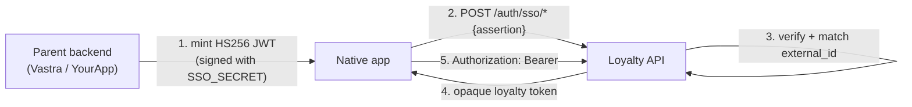
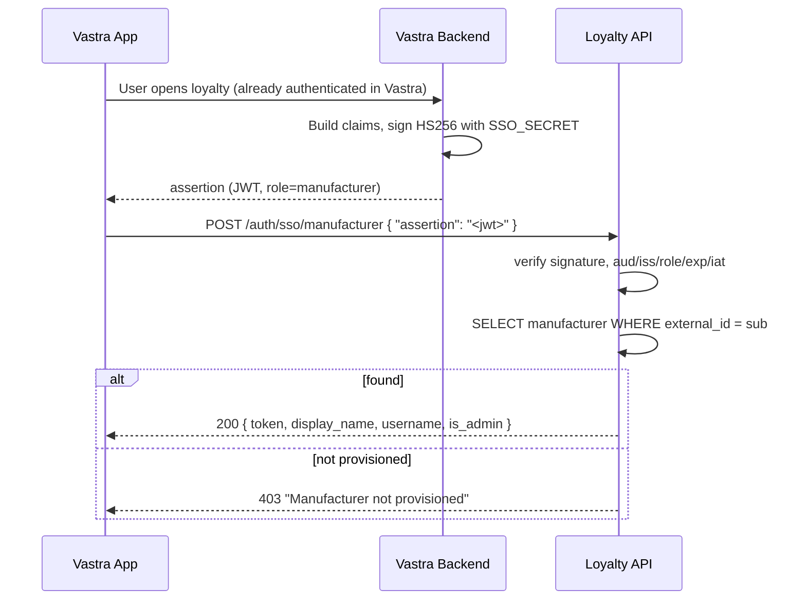
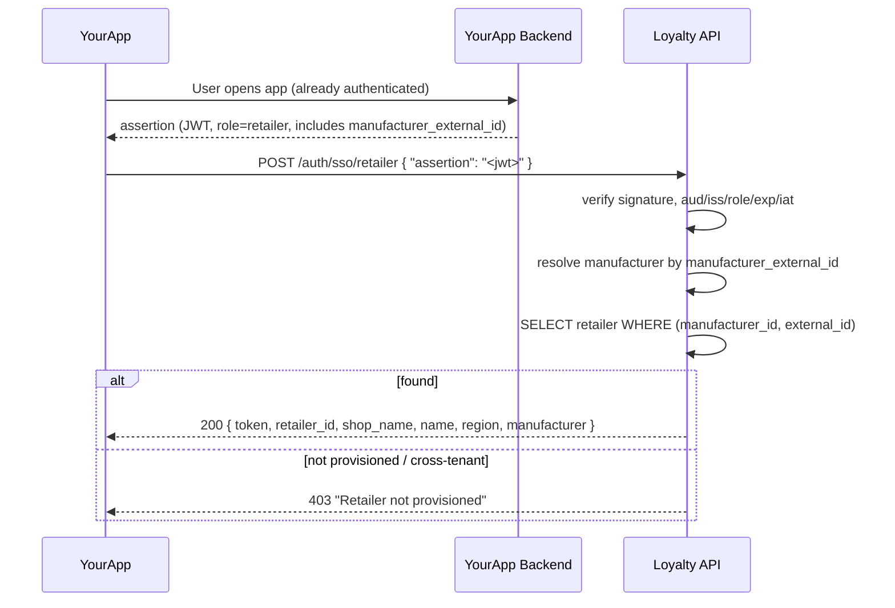

# SSO Integration

> Status: ✅ **Implemented** and live. See the [status legend](README.md).
> Related: [API_REFERENCE](API_REFERENCE.md), [ERROR_REFERENCE](ERROR_REFERENCE.md).

## 1. SSO architecture

Native Vastra/YourApp apps must not show a second login. The parent backend
(which already authenticated the user) mints a **short-lived HS256 JWT**
("assertion"). The app posts that assertion to a loyalty SSO endpoint, which
verifies it and returns a **normal opaque loyalty token** — identical in format
to the token returned by the legacy password logins. After the exchange the app
is an ordinary bearer-token client; every other loyalty endpoint is unchanged.



**Design choices (and why):**
- **HS256 shared secret** — both parent backends are first-party; one secret per
  environment, configured exactly like `QR_BASE_URL`/`DATABASE_URL`. No JWKS,
  no redirect flow.
- **Token exchange, not "validate JWT on every request"** — the exchange mints
  the same opaque tokens the existing dependencies already validate, so SSO added
  zero changes to other endpoints and keeps server-side revocation (logout).
- **No auto-provisioning** — principals must already exist (see §9, and
  [PRODUCT_INTEGRATION](PRODUCT_INTEGRATION.md) for the provisioning model).

## 2. Manufacturer authentication flow



## 3. Retailer authentication flow



## 4. JWT assertion format

Algorithm **HS256**, signed with the shared `SSO_SECRET`.

### Manufacturer assertion
```json
{
  "iss": "vastra",
  "aud": "loyalty",
  "role": "manufacturer",
  "sub": "<vastra manufacturer external_id>",
  "iat": 1750000000,
  "exp": 1750000100
}
```

### Retailer assertion
```json
{
  "iss": "yourapp",
  "aud": "loyalty",
  "role": "retailer",
  "sub": "<yourapp retailer external_id>",
  "manufacturer_external_id": "<the manufacturer this YourApp belongs to>",
  "iat": 1750000000,
  "exp": 1750000100
}
```

**Claim rules enforced by the loyalty backend:**

| Claim | Rule |
|---|---|
| alg | Must be `HS256`. `alg:none` and any other algorithm are rejected. |
| `iss` | Must be in `SSO_ISSUERS` (default `vastra,yourapp`). |
| `aud` | Must equal `SSO_AUDIENCE` (default `loyalty`). |
| `role` | Must equal the endpoint role (`manufacturer` / `retailer`). Prevents replay across endpoints. |
| `sub` | The parent `external_id`. Identity is taken **only** from here, never the request body. |
| `exp` | Required; standard expiry (with ~10s leeway). |
| `iat` | Required; must be within `SSO_MAX_AGE` seconds of now (replay window bound). |
| `manufacturer_external_id` | Retailer assertions only; scopes the retailer lookup to one tenant. |

Recommended `exp`: `iat + 120` (≤ `SSO_MAX_AGE`). Keep assertions single-use in
spirit; they are not stored, so do not reuse one.

## 5. Loyalty token exchange (responses)

Both endpoints return the **same body** as the corresponding password login, so
existing clients need no special handling.

`POST /auth/sso/manufacturer` →
```json
{ "token": "9f3a…", "display_name": "Acme Textiles", "username": "acme", "is_admin": false }
```

`POST /auth/sso/retailer` →
```json
{ "token": "7b21…", "retailer_id": 12, "shop_name": "Kumar Cloth",
  "name": "Kumar", "region": "Jaipur", "manufacturer": "Acme Textiles" }
```

The loyalty token is an **opaque random string** (`secrets.token_urlsafe(32)`),
sent on every subsequent call as `Authorization: Bearer <token>`. It is **not** a
JWT — do not attempt to decode it.

## 6. Token lifetime

- **The SSO assertion** is short-lived (≤ `SSO_MAX_AGE`, default 120 s). It is
  consumed once at exchange.
- **The loyalty token** has **no expiry column**, but the server keeps a **single
  active session** per principal: each SSO exchange (and each password login)
  deletes that account's previous tokens, so a fresh exchange **invalidates the
  old token**. Treat it as a session token: store it securely, and if a call
  returns `401`, obtain a **fresh assertion from your parent backend** and re-run
  the exchange to get a new loyalty token. (A blocked account returns `403 Account
  is blocked` at both exchange and on existing tokens — not client-fixable.)
- There is **no loyalty refresh token**. "Refresh" = re-exchange. How the parent
  app keeps *its own* session alive is out of scope — the only requirement is
  that the parent backend can mint a fresh assertion on demand.

## 7. Logout

Use the existing logout endpoints; they delete the loyalty token server-side:
- Manufacturer: `POST /auth/logout` (Bearer token).
- Retailer: `POST /auth/retailer/logout` (Bearer token).

Then discard the stored token on the device. There is no SSO-specific logout.

## 8. Error handling

| HTTP | When | Client action |
|---|---|---|
| `401 Invalid SSO assertion` | bad signature, wrong alg, bad `aud`/`iss`/`role`, malformed | Re-mint a fresh assertion and retry once; if it persists, config mismatch (secret/issuer/audience). |
| `401 SSO assertion expired` | `iat` older than `SSO_MAX_AGE` (or `exp` passed) | Mint a fresh assertion (check clock skew) and retry. |
| `401 Assertion missing manufacturer_external_id` | retailer assertion lacks the claim | Fix the parent token; do not retry as-is. |
| `403 Manufacturer not provisioned` | unknown manufacturer `external_id` | Provision the manufacturer in loyalty first. Not retryable. |
| `403 Retailer not provisioned` | unknown retailer, or cross-tenant mismatch | Provision the retailer (with `external_id`) under the correct manufacturer. Not retryable. |
| `503 SSO is not configured` | `SSO_SECRET` is unset on the server | Server config issue; contact DevOps. |
| `429` | rate limit (login bucket) exceeded | Back off and retry. |

Full catalog in [ERROR_REFERENCE](ERROR_REFERENCE.md).

## 9. Provisioning prerequisite

The exchange **never creates accounts**. Before SSO will succeed:
- **Manufacturers** must exist in loyalty with their `external_id` set (imported
  by Vastra before go-live).
- **Retailers** must exist with `external_id`, created by their manufacturer via
  `POST /retailers` or the `external_id` column of `POST /retailers/import`.
  Retailer `external_id` is unique **per manufacturer**.

## 10. Required environment variables

| Var | Required | Default | Purpose |
|---|---|---|---|
| `SSO_SECRET` | **Yes (to enable SSO)** | — | Shared HMAC secret. Unset → SSO endpoints return `503`. |
| `SSO_ISSUERS` | No | `vastra,yourapp` | Comma-separated allowed `iss` values. |
| `SSO_AUDIENCE` | No | `loyalty` | Required `aud` value. |
| `SSO_MAX_AGE` | No | `120` | Max assertion age (seconds); bounds replay. |

## 11. Integration checklist (SSO)

**Parent backend (Vastra / YourApp):**
- [ ] Hold `SSO_SECRET` securely (server-side only).
- [ ] Mint HS256 JWTs with the exact claims in §4; short `exp`.
- [ ] Provision manufacturers (with `external_id`) and retailers (with
      `external_id` per manufacturer) before enabling SSO.
- [ ] Be able to mint a fresh assertion on demand (for re-exchange on `401`).

**Mobile app:**
- [ ] Fetch assertion from parent backend; call the correct `/auth/sso/*` endpoint.
- [ ] Store the loyalty token in the OS secure store (Keychain / Keystore).
- [ ] Send `Authorization: Bearer <token>` on all subsequent calls.
- [ ] On `401`, re-exchange; on `403`, show "not set up / contact manufacturer".
- [ ] Call the matching logout endpoint and clear the token on sign-out.

**DevOps:**
- [ ] Set `SSO_SECRET` (strong, per-environment, out of source control).
- [ ] Serve over HTTPS. Optionally tune `SSO_ISSUERS`/`SSO_AUDIENCE`/`SSO_MAX_AGE`.
