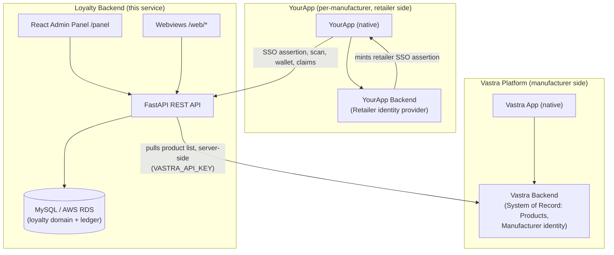
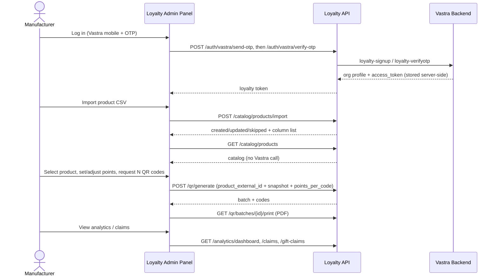
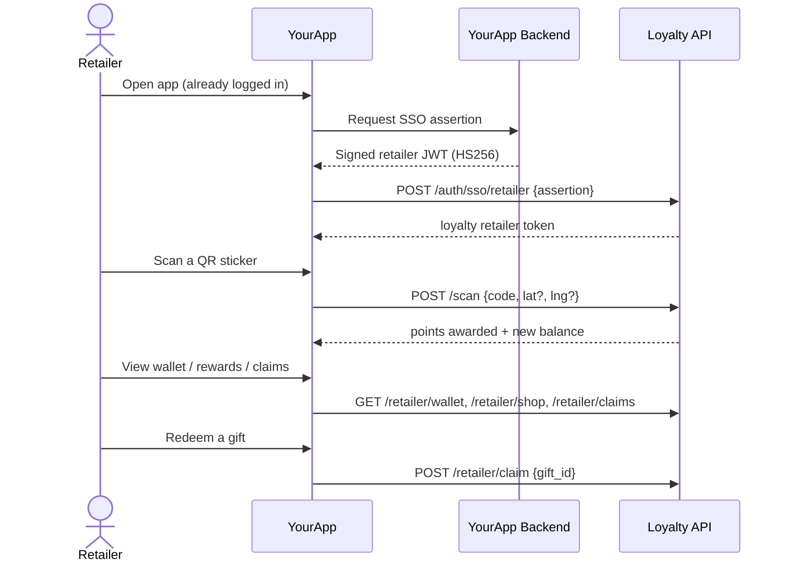
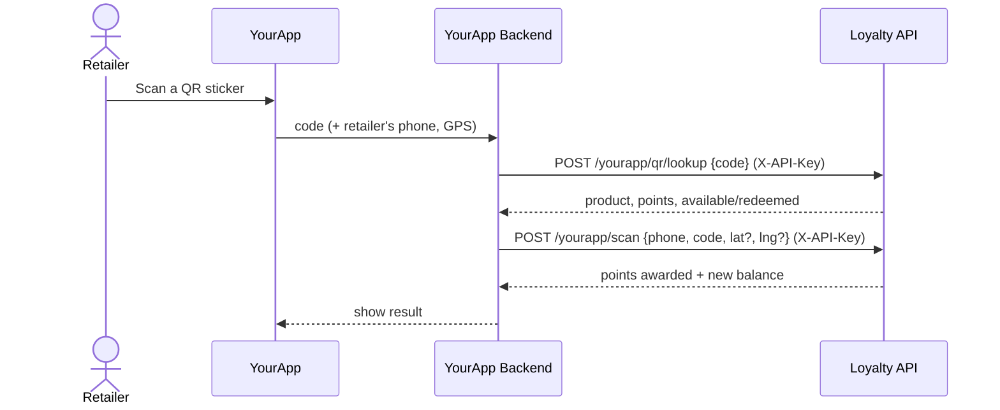
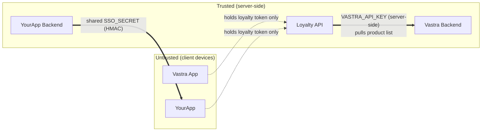

# System Architecture

> Audience: Vastra backend + mobile integrators. See the [status legend](README.md).

## 1. Overview

The Loyalty QR backend is a single **FastAPI** service (Python 3.12+) backed by
**MySQL** in production (SQLite for local dev). It powers a
manufacturer→retailer loyalty program: manufacturers generate QR codes that are
printed on product/box stickers; retailers scan them to earn points and redeem
gifts.

It serves three surfaces from one container:

- **REST API** (`/…`, docs at `/docs`) — the source of truth for all loyalty data.
- **React admin panel** (`/panel`) — manufacturer + super-admin web UI.
- **Plain-HTML webviews** (`/web/*`) — the current mobile UI; being replaced by
  native Vastra/YourApp screens that call the REST API directly.

The loyalty backend is a pure request/response service: **no background jobs, no
cron, no workers, no message queue.** Schema migrations run synchronously on boot.

## 2. System components

QR generation is no longer a Vastra-App/Vastra-Backend-originated flow — the
manufacturer logs into the Loyalty Admin Panel directly (**Vastra mobile +
OTP**, `POST /auth/vastra/send-otp` → `/auth/vastra/verify-otp`, which also
stores the Vastra `access_token`, though nothing reads it today; plain password
login works equally well for the catalog) and generates codes from there. The
panel's product picker is powered by the manufacturer's **own CSV import**
(`POST /catalog/products/import`) — loyalty does not pull products from Vastra,
because `get-design-ids` returns no design *name*. Manufacturer SSO (`VBack` minting an assertion for
`VApp`) still exists in the codebase but its continued purpose is unclear now
that QR generation doesn't need it — see [PRODUCT_INTEGRATION](PRODUCT_INTEGRATION.md) §8.

## 3. Responsibility of each system

| System | Responsibility |
|---|---|
| **Vastra Backend** | System of Record for **products** and **manufacturer identity**. Authenticates manufacturers for the panel via mobile + OTP (`loyalty-signup`/`loyalty-verifyotp`, issuing the per-org `access_token`) and serves its design list to the Loyalty Backend (server-side pull with that token, read-only) so the panel can power QR generation; no longer originates QR generation itself. Manufacturer SSO assertion minting still exists but its continued purpose (beyond the now-removed generation flow) is unclear. |
| **YourApp Backend** | Identity provider for **retailers**. Authenticates retailers and mints retailer SSO assertions. |
| **Loyalty Backend** | System of Record for the **loyalty domain**: QR batches/codes, the points ledger & wallets, schemes, gifts, claims, and analytics. Validates and redeems QR codes; enforces multi-tenancy. |
| **Loyalty Admin Panel** | Web client of the Loyalty API for manufacturers + super admin. |
| **Native apps (Vastra App / YourApp)** | Presentation clients. Exchange a parent assertion for a loyalty token, then call loyalty APIs. |

## 4. Domain ownership

SoR = System of Record (owns lifecycle + truth). "Ref" = referenced by external
id. "Snapshot" = point-in-time copy stored in loyalty so history never changes.

| Entity | SoR | Read by | Written by | In Loyalty |
|---|---|---|---|---|
| **Manufacturers** | Vastra | Vastra, Loyalty, Panel | Vastra (provision); Loyalty (panel password, tokens) | Ref via `external_id`; `display_name` local copy |
| **Retailers** | Split: identity = YourApp/Vastra; loyalty profile = Loyalty | all | Upstream (identity); Loyalty (region, location, distributor) | Ref via `external_id` |
| **Products** | **The manufacturer** (their own CSV export) | Loyalty (catalog + snapshot), Panel | Manufacturer, via `POST /catalog/products/import`; points via the panel | ✅ Ref via `product_external_id` (= product code) + **snapshot**; catalog in `product_points` where `source='import'` (see [PRODUCT_INTEGRATION](PRODUCT_INTEGRATION.md)) |
| **QR Batches** | Loyalty | Loyalty, Panel, Vastra App | Loyalty (triggered by Vastra) | Owned; embeds product snapshot |
| **QR Codes** | Loyalty | Loyalty, scanners | Loyalty (generate; redeem) | Owned outright |
| **Schemes** | Loyalty | Loyalty, Panel | Loyalty (manufacturer) | Owned; references products by id |
| **Wallets** | Loyalty | Loyalty, clients | Loyalty (via ledger only) | Owned (derived = `SUM(ledger)`) |
| **Claims** | Loyalty | Loyalty, Panel, retailer | Loyalty (claim / approve / reject) | Owned |
| **Gifts** | Loyalty | Loyalty, Panel, retailer | Loyalty (manufacturer) | Owned |
| **Analytics** | Loyalty (derived) | Panel, Vastra | nobody (computed) | Owned / derived |
| **Points Ledger** | Loyalty | Loyalty, Panel | Loyalty (append-only) | Owned; holds snapshots (region, distributor, product) |

**Principle:** identity is owned upstream (referenced by `external_id`); loyalty
*value* (points, codes, claims) is owned by loyalty. Reference the living,
snapshot the historical.

## 5. Manufacturer flow (high level)

Vastra Backend's role in this flow is now limited to serving its product
list to Loyalty (a plain, read-only, server-side GET) — it no longer
originates or participates in the QR-generation request itself.

## 6. Retailer flow (high level)

**Server-to-server variant (phone-verified, no retailer session):** YourApp's
backend can scan on the retailer's behalf without the SSO exchange:

The retailer is resolved by the **phone number registered in loyalty**
(imported from YourApp data), matched on the last 10 digits within the scanned
code's manufacturer. Auth is the shared `YOURAPP_API_KEY` (`X-API-Key`
header, server-side only; unset → `503`).

## 7. Trust boundaries

Key boundary rules:
- **The shared `SSO_SECRET` lives only on backends**, never in a mobile app.
  (Its use for manufacturer QR generation is gone — see §3; retailer SSO is
  unaffected.)
- **`VASTRA_API_KEY` lives only on the Loyalty Backend**, never in the panel
  browser bundle — the panel calls the OTP-login endpoints on Loyalty, which
  makes the actual call to Vastra server-side.
- **Mobile/browser clients are untrusted**: the panel never asserts a
  points-per-scan value on Vastra's behalf and never holds Vastra
  credentials; the manufacturer's chosen points value is their own loyalty
  data, authenticated by their own loyalty session.
- **Retailer identity at scan time comes only from the loyalty token**, never
  from the request body — points can only be credited to the authenticated
  retailer. (On the server-to-server `/yourapp/scan` path the identity is the
  registered phone number, but the caller is YourApp's **backend**
  authenticated by `YOURAPP_API_KEY` — still never a client device, and the
  phone lookup is scoped to the scanned code's manufacturer.)
- **`YOURAPP_API_KEY` lives only on YourApp's backend and the Loyalty env**,
  never in a mobile app build.
- **Cross-tenant isolation:** every owned row carries `manufacturer_id`; a
  retailer belongs to exactly one manufacturer; cross-manufacturer scans/claims
  are rejected.

## 8. Data ownership principles

1. **Single SoR per entity** — no system writes another system's source of truth.
2. **Reference for the living, snapshot for the historical** — current upstream
   records are referenced by `external_id`; values that must stay correct forever
   (points on a printed sticker, product name on a past scan) are snapshotted.
3. **Append-only ledger** — all balance changes are ledger rows; the wallet is
   `SUM(points_ledger)`, never a mutable field. See [QR_WORKFLOW](QR_WORKFLOW.md).
4. **No second catalog** — loyalty stores product *references and snapshots*, not
   a product catalog. See [PRODUCT_INTEGRATION](PRODUCT_INTEGRATION.md).
